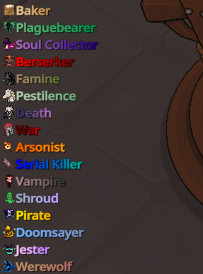
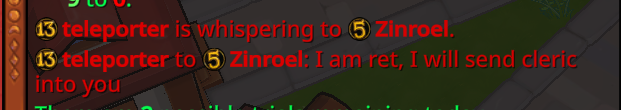
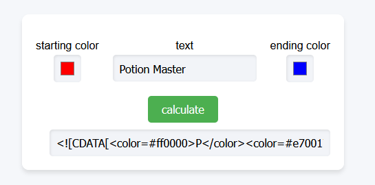

# Mod Guide: Text Editor

<Badge text="written by someone who isn't the creator of the mod" />

Text Editor can be used to change text of what you see in game. This is relatively easy to do, as all text in the game is specified in a "xml" file to make language localisation easier on the game developers' side.

This mod also enables the ability to change colors, as rich-text is enabled in some parts of the game, as seen below.



## Usage

After downloading the mod and restarting, you may notice your game has weird names for every piece of text. This is intentional as it shows you what text you can change with specific _keys_. For example, if you notice the name of the button that is normally "Play," and find the corresponding key in the string table, you can edit what "Play" will display as.

Disable this in the mod settings to view text normally.

### Dumping String Tables

The "xml" files referred to earlier are known as string tables in-game, and are a major component of how Text Editor functions. Go to **Mod Actions** on the main menu, and dump the string tables.

After dumping string tables, you will see two folders in `SalemModLoader/ModFolders/TextEditor/` named `Custom` and `Dumped`.

Inspect the `Dumped` folder for the string table that corresponds to your language, and find the keys you wish to change.

### Creating a Custom String Table

Make a new file in the `Custom` folder, following the format of the original string table including the xml tags, shown below;

```xml
<StringTable>
    <Entry key="...">...</Entry>
</StringTable>
```

Change the text in the middle of the `<Entry> </Entry>` tags to change what will show up in game, and then save the file named as `StringTable.en-US.xml` (or replace `en-US` with your language code).

::: warning
Only import the keys you wish to change. When the game updates, it may change keys and result in you seeing incorrect text in-game!
:::

### Using Colours

To create gradients for any text in-game that supports rich-text, you will need to wrap your text in a specific format of `<[[CDATA]]>` to denote that rich-text is being used here.

A basic example of this is;

```xml:no-line-numbers
<Entry key="GUI_XIS_WHISPERING_TO_Y" style="whisper_notice">
    <![CDATA[<color=#ffff66>]]>%name1% is whispering to %name2%.<![CDATA[</color>]]>
</Entry>
```

This specific example shows **Wildling** whispers in a different colour, prior to the update that included this as a vanilla change.



### Using Gradients

An easy tool created to make gradients is available at [nyapat.github.io/gradients](https://nyapat.github.io/gradients)

Simply input the text you wish to change, and choose two colours to interpolate between. After clicking the calculate button, the text will automatically be generated for you, and you can simply copy it into your final string table.


